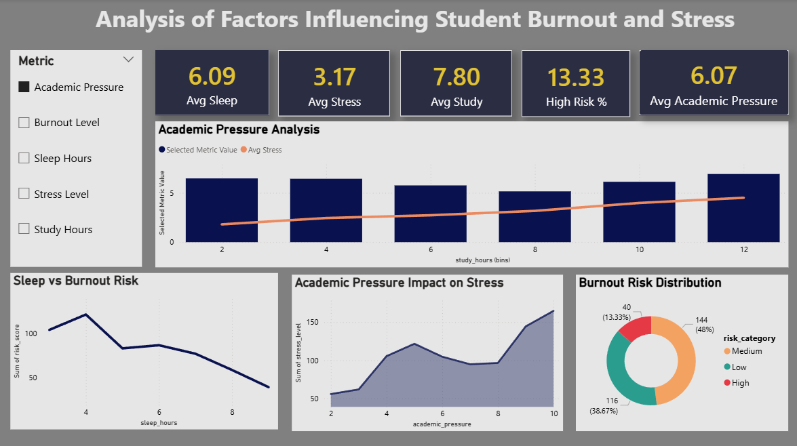

# 📊 Student Burnout Analysis Dashboard

## 📌 Overview

This project analyzes student burnout using data-driven insights.
It explores how factors such as sleep hours, academic pressure, and study hours impact stress and burnout levels.

---

## 🚀 Tools Used

* Power BI (Dashboard)
* Python (Data Analysis)
* SQL (Data Extraction)
* Excel (Data Cleaning)

---

## 📈 Dashboard Features

* Interactive KPI cards (Sleep, Stress, Study, Burnout Risk)
* Dynamic metric selector
* Combo chart (trend + comparison)
* Sleep vs Burnout analysis
* Academic Pressure vs Stress analysis
* Burnout risk distribution (donut chart)

---

## 🔍 Key Insights

* Lower sleep duration increases burnout risk
* Academic pressure strongly affects stress levels
* Excessive study hours do not reduce stress significantly
* Majority of students fall under medium to high burnout risk

---

## 📂 Project Structure

* `dashboard.pbix` → Power BI dashboard
* `dashboard.png` → Dashboard preview
* `final_student_burnout.ipynb` → Python analysis
* `sql_analysis.sql` → SQL queries
* `processed_data.xlsx` → Clean dataset
* `raw_data.xlsx` → Raw dataset

---

## 📸 Dashboard Preview

---

## 🎯 Conclusion

This project demonstrates how data analytics can be used to understand student well-being and identify key factors contributing to burnout.

---
